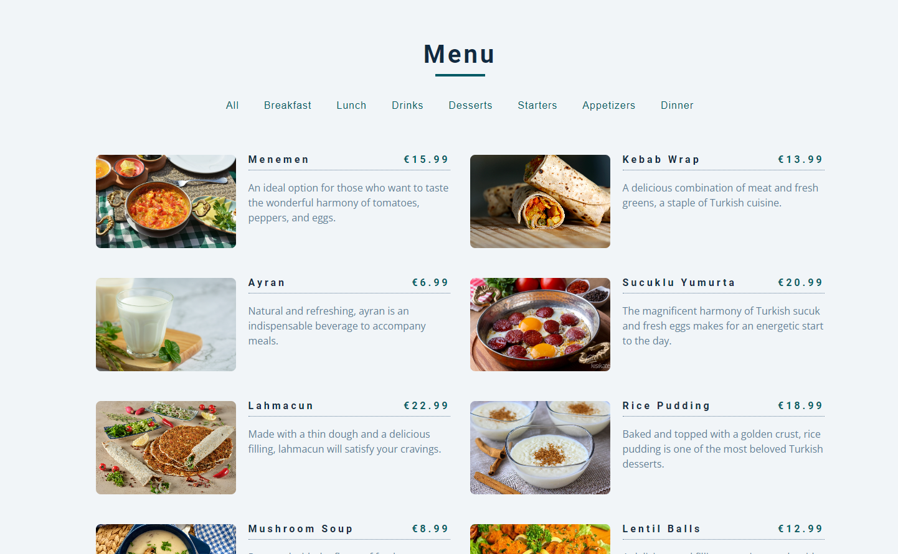

# Image gallery

> A simple food menu project

## Table of contents

- [Image gallery](#image-gallery)
  - [Table of contents](#table-of-contents)
  - [General info](#general-info)
  - [Screenshots](#screenshots)
  - [Technologies](#technologies)
  - [Setup](#setup)
  - [Code Examples](#code-examples)
  - [Status](#status)
  - [Contact](#contact)

## General info

> The objective of the project is to practice separation of concern in
> JavaScript.

## Screenshots



## Technologies

- JavaScript
- HTML5
- CSS3
- VSC code

## Setup

Clone the repo and run `npm install`

## Code Examples

```js
const loadHandler = () => {
	data.buttons.forEach((btnData) => {
		const btn = createButton(btnData);
		dom.btnContainer.append(btn);
	});

	data.menu.forEach((itemData) => {
		const article = createItem(itemData);
		dom.sectionContainer.append(article);
	});
};
```

## Status

Project is: _done_

## Contact

[Gultekin Birol](https://github.com/gultekinbirol)
